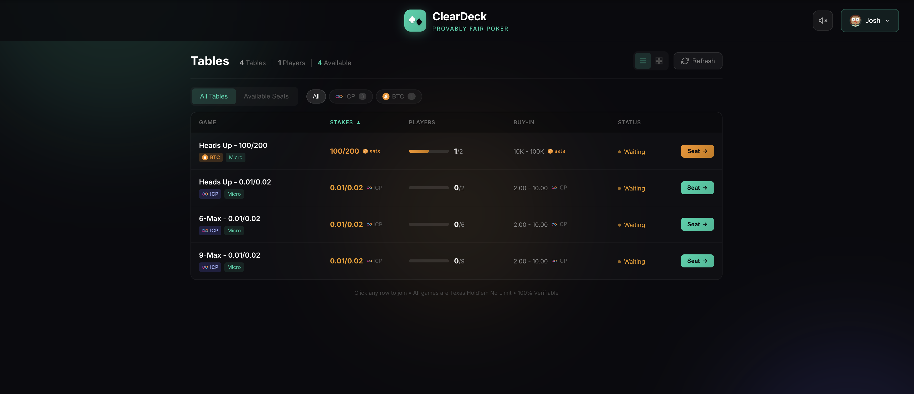
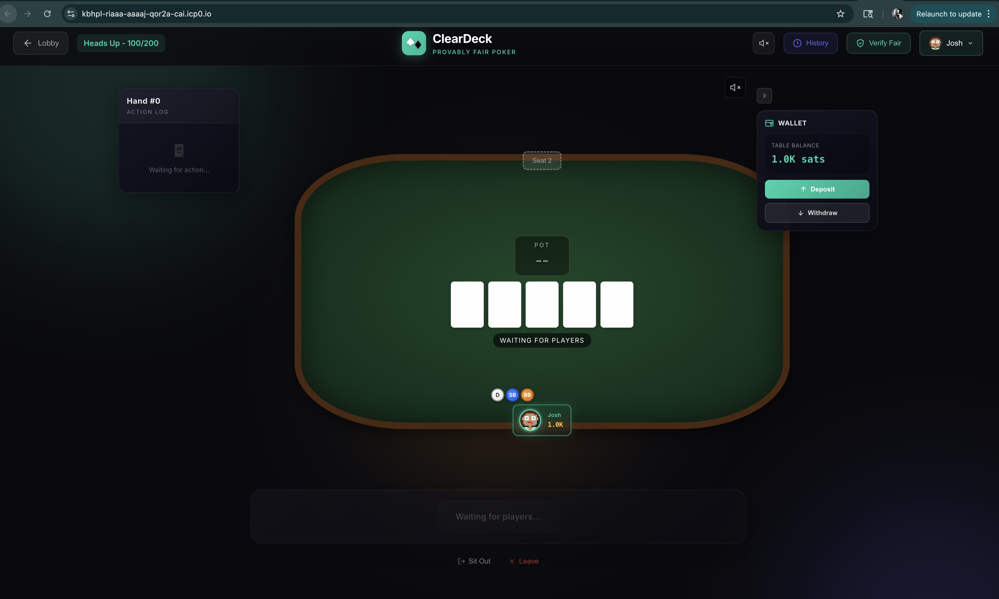

# ClearDeck

**Provably Fair Poker on the Internet Computer**

> **This entire project was built 100% by AI** (Claude Code) to demonstrate what's possible with AI-assisted development and the Internet Computer blockchain.

ClearDeck is a fully decentralized Texas Hold'em poker application running entirely on the Internet Computer. Every card shuffle is cryptographically verifiable, ensuring fair play without requiring trust. No middleman, no house edge—just pure poker.

## Screenshots

<p align="center">
  
  <br/><em>Lobby - Browse available tables with different stakes</em>
</p>

<p align="center">
  
  <br/><em>Poker Table - Real-time gameplay with BTC stakes</em>
</p>

## Live Demo

**[Play Now](https://kbhpl-riaaa-aaaaj-qor2a-cai.icp0.io/)** | **[GitHub](https://github.com/JoshDFN/cleardeck)**

---

## Features

| Feature | Description |
|---------|-------------|
| **Real Money** | Play with ICP or Bitcoin (via ckBTC) |
| **Provably Fair** | Every shuffle cryptographically verifiable |
| **100% On-Chain** | Frontend, backend, and game logic all on IC |
| **Decentralized Auth** | Internet Identity - no passwords |
| **Instant Deposits** | Direct ledger transfers |
| **Hand History** | Review all past hands with proofs |
| **Time Bank** | Extra time for tough decisions |
| **Multiple Tables** | Heads-up, 6-max, 9-max configurations |

---

## Tech Stack

| Layer | Technology |
|-------|------------|
| **Frontend** | SvelteKit 5, Vite, TypeScript, SCSS |
| **Backend** | Rust, IC CDK 0.19, Candid |
| **Blockchain** | Internet Computer, ckBTC |
| **Auth** | Internet Identity |
| **Crypto** | SHA-256, IC VRF (threshold BLS) |
| **Payments** | ICRC-1/ICRC-2 ledger standards |

---

## Disclaimer

> ⚠️ **WARNING**: This is unaudited alpha software with known bugs. This is for educational and testing purposes only. Any deposit of ICP or Bitcoin is at your own risk—your funds are NOT safe. Expect to lose everything you deposit. Online gambling is illegal in many jurisdictions. Only use where legally permitted. 18+ only.

---

## Architecture

### 100% On-Chain
- **Frontend**: Served from IC canisters (no AWS, no servers)
- **Backend**: All game logic in Rust smart contracts
- **Authentication**: Internet Identity (decentralized)
- **Randomness**: IC's Verifiable Random Function (VRF)
- **Payments**: Real ICP and Bitcoin (via ckBTC)

### Provably Fair
Every shuffle uses a commit-reveal scheme:
1. Before dealing: Seed hash is committed publicly
2. After hand: Full seed is revealed
3. Anyone can verify: Recalculate the shuffle yourself

### Dual Currency Support
- **ICP Tables**: Play with Internet Computer tokens
- **BTC Tables**: Play with Bitcoin (via ckBTC)

---

## Mainnet Canister IDs

| Canister | ID | Purpose |
|----------|-----|---------|
| Frontend | [`kbhpl-riaaa-aaaaj-qor2a-cai`](https://kbhpl-riaaa-aaaaj-qor2a-cai.icp0.io/) | SvelteKit web app |
| Lobby | `kpfcd-kyaaa-aaaaj-qor3a-cai` | Table discovery |
| History | `kggj7-4qaaa-aaaaj-qor2q-cai` | Permanent hand records |
| Table 1 | `kieex-haaaa-aaaaj-qor3q-cai` | Heads-up 0.01/0.02 ICP |
| Table 2 | `lfkaz-iiaaa-aaaaj-qor4a-cai` | 6-max 0.05/0.10 ICP |
| Table 3 | `lclgn-fqaaa-aaaaj-qor4q-cai` | 9-max 0.10/0.20 ICP |
| BTC Table | `qrhly-eaaaa-aaaaj-qousa-cai` | Heads-up 100/200 sats |

---

## Verify the Code (Reproducible Builds)

You can verify that the deployed canisters match this source code:

### Quick Verification

```bash
# Check the deployed WASM hash
dfx canister info kpfcd-kyaaa-aaaaj-qor3a-cai --network ic

# Build locally and compare
docker build -t cleardeck-verify .
docker run --rm cleardeck-verify
```

### Manual Verification Steps

1. **Get the deployed hash:**
   ```bash
   dfx canister info <canister-id> --network ic | grep "Module hash"
   ```

2. **Build from source in Docker:**
   ```bash
   docker build -t cleardeck-verify .
   docker run --rm cleardeck-verify
   ```

3. **Compare the hashes** - they should match exactly.

---

## Local Development Setup

### Prerequisites

**Rust**
```bash
curl --proto '=https' --tlsv1.2 -sSf https://sh.rustup.rs | sh
rustup target add wasm32-unknown-unknown
```

**Node.js 18+**
```bash
# Using nvm
nvm install 18 && nvm use 18
```

**DFX (Internet Computer SDK)**
```bash
sh -ci "$(curl -fsSL https://internetcomputer.org/install.sh)"
```

### Quick Start

```bash
# Clone the repo
git clone https://github.com/JoshDFN/cleardeck.git
cd cleardeck

# Install dependencies
npm install

# Start local replica
dfx start --background

# Deploy everything
dfx deploy

# Open the URL printed by dfx deploy
```

### Development Mode (Hot Reload)

```bash
# Terminal 1: Start replica and deploy backend
dfx start --background
dfx deploy lobby table_1 table_2 table_3 history

# Terminal 2: Start frontend dev server
cd src/cleardeck_frontend
npm run dev
```

Access at `http://localhost:5173`

---

## Project Architecture

```
cleardeck/
├── src/
│   ├── lobby_canister/          # Table discovery & management
│   │   └── src/lib.rs
│   ├── table_canister/          # Core poker logic
│   │   ├── src/lib.rs           # 4500+ lines of poker engine
│   │   └── table_canister.did   # Candid interface
│   ├── history_canister/        # Permanent hand storage
│   │   └── src/lib.rs
│   └── cleardeck_frontend/      # SvelteKit 5 + Vite
│       └── src/
│           ├── routes/+page.svelte
│           └── lib/components/
│               ├── PokerTable.svelte
│               ├── Lobby.svelte
│               ├── DepositModal.svelte
│               └── ...
├── dfx.json                     # Canister configuration
├── Cargo.toml                   # Rust workspace
└── Dockerfile                   # Reproducible builds
```

---

## Technical Deep Dive

### Cryptographic Shuffle (Provably Fair)

The shuffle uses IC's VRF + commit-reveal:

```
BEFORE DEALING:
1. IC VRF generates 32 random bytes (threshold BLS)
2. seed_hash = SHA256(random_bytes)
3. Commit seed_hash publicly
4. Shuffle deck using Fisher-Yates with SHA256 chain
5. Deal cards

AFTER HAND:
6. Reveal original random_bytes
7. Store in history canister
8. Anyone can verify: SHA256(seed) == committed_hash
```

### Fisher-Yates Implementation

```rust
fn shuffle_deck(deck: &mut Vec<Card>, seed: &[u8]) {
    let mut hash_input = seed.to_vec();

    for i in (1..deck.len()).rev() {
        // Hash chain for unpredictability
        let mut hasher = Sha256::new();
        hasher.update(&hash_input);
        hasher.update(&[i as u8]);
        let hash = hasher.finalize();

        // Use first 8 bytes for index
        let random = u64::from_le_bytes(hash[0..8].try_into().unwrap());
        let j = (random as usize) % (i + 1);

        deck.swap(i, j);
        hash_input = hash.to_vec();
    }
}
```

**Properties:**
- Deterministic: Same seed = same shuffle
- Unpredictable: Can't predict cards without seed
- Verifiable: Anyone can replay and verify

### ICP Deposits & Withdrawals

```
DEPOSIT:
Player Wallet → ICP Ledger → notify_deposit(block_index) → Table Canister
                                    ↓
                             Verify on ledger
                                    ↓
                             Credit escrow balance

WITHDRAWAL:
Table Canister → ICRC-1 transfer → Player Wallet
```

### ckBTC Integration

For Bitcoin tables, we use ckBTC (chain-key Bitcoin):

1. **Get BTC address**: Table canister generates a unique BTC address per user
2. **Send BTC**: User sends real Bitcoin to that address
3. **Mint ckBTC**: After 6 confirmations, ckBTC is minted 1:1
4. **Play**: Use ckBTC at the table (10 sats transfer fee)
5. **Withdraw**: Convert back to real BTC via ckBTC minter

---

## Table Configuration

Defined in `dfx.json`:

```json
{
  "table_1": {
    "init_arg": "(record {
      small_blind = 1000000 : nat64;      // 0.01 ICP
      big_blind = 2000000 : nat64;        // 0.02 ICP
      min_buy_in = 200000000 : nat64;     // 2 ICP
      max_buy_in = 1000000000 : nat64;    // 10 ICP
      max_players = 2 : nat8;             // Heads-up
      action_timeout_secs = 30 : nat64;
      time_bank_secs = 30 : nat64;
      currency = variant { ICP }
    })"
  }
}
```

**BTC Table:**
```json
{
  "btc_table_1": {
    "init_arg": "(record {
      small_blind = 100 : nat64;          // 100 sats
      big_blind = 200 : nat64;            // 200 sats
      min_buy_in = 10000 : nat64;         // 10,000 sats
      max_buy_in = 100000 : nat64;        // 100,000 sats
      max_players = 2 : nat8;
      currency = variant { BTC }
    })"
  }
}
```

---

## Game Features

- **Real Money**: ICP and Bitcoin deposits/withdrawals
- **Provably Fair**: Every shuffle verifiable
- **Time Bank**: 30s extra time for tough decisions
- **Auto-Deal**: Hands start automatically
- **Hand History**: Review all past hands with proofs
- **Sit Out**: Take breaks without leaving
- **Side Pots**: Proper all-in handling
- **Display Names**: Custom nicknames (1-12 chars)

---

## API Reference

### Table Canister

```candid
// Join table at seat
join_table : (seat: nat8) -> (Result);

// Player actions
player_action : (action: PlayerAction) -> (Result);
  // PlayerAction = Fold | Check | Call | Raise(amount) | AllIn

// Deposit (after ICP transfer)
notify_deposit : (block_index: nat64) -> (Result_1);

// Withdraw to wallet
withdraw : (amount: nat64) -> (Result_1);

// Cash out from table
cash_out : () -> (Result_1);

// Get table state (hides opponent cards)
get_table_view : () -> (opt TableView) query;

// BTC: Get deposit address
get_btc_deposit_address : () -> (variant { Ok : text; Err : text });

// BTC: Check for new deposits
update_btc_balance : () -> (variant { Ok : vec UtxoStatus; Err : text });
```

### History Canister

```candid
// Get specific hand
get_hand : (hand_id: nat64) -> (opt HandHistoryRecord) query;

// Get player's hands
get_hands_by_player : (principal, offset: nat64, limit: nat64)
  -> (vec HandSummary) query;

// Verify shuffle
verify_hand_shuffle : (hand_id: nat64) -> (Result<bool, text>);
```

---

## Deploying to Mainnet

### 1. Get Cycles
```bash
# Create identity
dfx identity new cleardeck-prod
dfx identity use cleardeck-prod

# Need ~5T cycles
dfx cycles balance --network ic
```

### 2. Create & Deploy Canisters
```bash
# Create canisters
dfx canister create --all --network ic

# Deploy
dfx deploy --network ic
```

### 3. Authorize Tables
```bash
# Get table IDs
dfx canister id table_1 --network ic

# Authorize in history
dfx canister call history authorize_table \
  '(principal "<table-id>")' --network ic
```

### 4. Fund Tables
Table canisters need ICP/ckBTC for paying withdrawal fees:
```bash
# Send 1 ICP for withdrawal fees
dfx ledger transfer <table-account-id> --amount 1.0 --network ic
```

---

## Security Considerations

1. **Unaudited Code**: This is alpha software—expect bugs
2. **Stable Storage**: Uses stable memory for upgrades, but bugs can still cause data loss
3. **Canister Cycles**: Monitor cycles—if depleted, canisters stop
4. **Key Security**: Controller identity must be secured
5. **No Rake**: There's no house edge—this is purely peer-to-peer

---

## Known Issues

**Resolved in latest version:**
- ✅ Hand history phase tracking now works correctly
- ✅ BB option resets properly on aggressive actions
- ✅ Heartbeat endpoint has rate limiting
- ✅ Pot remainder goes to first clockwise from dealer (correct poker rules)
- ✅ Username registration race condition fixed
- ✅ MAX withdraw button now withdraws full balance

**Remaining known issues:**
- Hand history may be lost during canister upgrades (stable memory limitations)
- BTC deposits require 6 confirmations (~1 hour)
- Large pots may have rounding issues (e8s precision)
- UI may lag on slow connections (polling-based updates)
- History canister indexes grow unboundedly (long-term memory concern)

---

## Built With

- **Backend**: Rust, IC CDK, SHA256, ICRC-1/ICRC-2
- **Frontend**: SvelteKit 5, Vite, SCSS
- **Blockchain**: Internet Computer, ckBTC
- **Auth**: Internet Identity
- **AI**: Claude (100% AI-generated code)

---

## Build Your Own with Claude Code

This project is designed to be forked, studied, and extended. **Everything was built with AI** (Claude Code), so you can continue development the same way.

### Prerequisites

| Requirement | Installation |
|-------------|--------------|
| **Rust** | `curl --proto '=https' --tlsv1.2 -sSf https://sh.rustup.rs \| sh` |
| **Wasm target** | `rustup target add wasm32-unknown-unknown` |
| **Node.js 18+** | `nvm install 18` |
| **DFX SDK** | `sh -ci "$(curl -fsSL https://internetcomputer.org/install.sh)"` |
| **Claude Code** | [Download](https://claude.ai/download) (optional, for AI development) |

### Quick Start (Local)

```bash
# Clone the repo
git clone https://github.com/JoshDFN/cleardeck.git
cd cleardeck

# Install dependencies
npm install

# Start local IC replica
dfx start --background

# Deploy all canisters
dfx deploy

# Open the URL printed by dfx deploy
# Usually: http://127.0.0.1:4943/?canisterId=...
```

### Continue Building with Claude Code

This entire codebase was generated using [Claude Code](https://claude.ai/download). To continue development:

```bash
# 1. Install Claude Code CLI
npm install -g @anthropic/claude-code

# 2. Navigate to the project
cd cleardeck

# 3. Start Claude Code
claude

# 4. Ask Claude to add features or fix bugs:
#    "Add tournament mode with buy-ins"
#    "Fix the pot calculation for split pots"
#    "Add player statistics tracking"
```

### Example Claude Code Prompts

| Task | Prompt |
|------|--------|
| Add feature | "Add a chat system so players can message each other at the table" |
| Fix bug | "The BB option isn't being reset when someone raises" |
| Understand code | "Explain how the provably fair shuffle works" |
| Deploy | "Deploy the changes to mainnet" |
| Add tests | "Write unit tests for the hand evaluation logic" |

### Ideas for Extensions

- **Tournaments**: Multi-table tournament support
- **Chat**: In-game messaging
- **Avatars**: NFT avatar integration
- **Statistics**: Detailed player analytics
- **Mobile**: Native mobile apps
- **More Games**: Omaha, Stud, etc.
- **Private Tables**: Password-protected games

### The AI Development Workflow

This project demonstrates a complete AI-built application:

```
User Prompt → Claude Code → Rust/Svelte Code → IC Canisters → Live App
```

Every line of code—4500+ lines of Rust poker logic, 2000+ lines of Svelte UI, Candid interfaces, deployment scripts—was generated by Claude based on natural language prompts.

---

## Contributing

Contributions are welcome:

1. Fork the repo
2. Create a feature branch
3. Submit a PR

Please note this is experimental software.

---

## License

MIT License

---

## Links

- **Live App**: [kbhpl-riaaa-aaaaj-qor2a-cai.icp0.io](https://kbhpl-riaaa-aaaaj-qor2a-cai.icp0.io/)
- **GitHub**: [github.com/JoshDFN/cleardeck](https://github.com/JoshDFN/cleardeck)
- **Internet Computer**: [internetcomputer.org](https://internetcomputer.org/)
- **ckBTC**: [internetcomputer.org/ckbtc](https://internetcomputer.org/ckbtc)

---

**ClearDeck** — No middleman, no house. 100% on-chain poker, built by AI.
