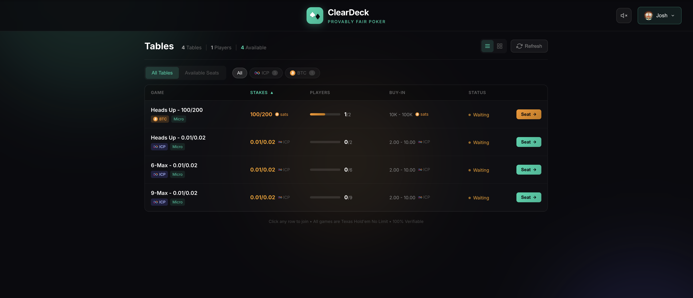
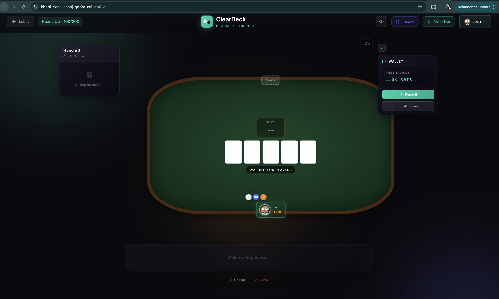

# ClearDeck

**Provably Fair Poker on the Internet Computer**

> **This entire project was built 100% by AI** (Claude Code) to demonstrate what's possible with AI-assisted development and the Internet Computer blockchain.

ClearDeck is a fully decentralized Texas Hold'em poker application running entirely on the Internet Computer. Every card shuffle is cryptographically verifiable, ensuring fair play without requiring trust. No middleman, no house edge—just pure poker.

## Screenshots

<p align="center">
  
  <br/><em>Lobby - Browse available tables with different stakes</em>
</p>

<p align="center">
  
  <br/><em>Poker Table - Real-time gameplay with BTC stakes</em>
</p>

## Demo

**[View Demo](https://kbhpl-riaaa-aaaaj-qor2a-cai.icp0.io/)** | **[GitHub](https://github.com/JoshDFN/cleardeck)**

---

## Features

| Feature | Description |
|---------|-------------|
| **Real Money** | Play with ICP or Bitcoin (via ckBTC) |
| **Provably Fair** | Every shuffle cryptographically verifiable |
| **100% On-Chain** | Frontend, backend, and game logic all on IC |
| **Decentralized Auth** | Internet Identity - no passwords |
| **Instant Deposits** | Direct ledger transfers |
| **Hand History** | Review all past hands with proofs |
| **Time Bank** | Extra time for tough decisions |
| **Multiple Tables** | Heads-up, 6-max, 9-max configurations |

---

## Tech Stack

| Layer | Technology |
|-------|------------|
| **Frontend** | SvelteKit 5, Vite, TypeScript, SCSS |
| **Backend** | Rust, IC CDK 0.19, Candid |
| **Blockchain** | Internet Computer, ckBTC |
| **Auth** | Internet Identity |
| **Crypto** | SHA-256, IC VRF (threshold BLS) |
| **Payments** | ICRC-1/ICRC-2 ledger standards |

---

## Disclaimer

> ⚠️ **WARNING**: This is unaudited alpha software with known bugs. This is for educational and testing purposes only. Any deposit of ICP or Bitcoin is at your own risk—your funds are NOT safe. Expect to lose everything you deposit. Online gambling is illegal in many jurisdictions. Only use where legally permitted. 18+ only.

---

## Architecture

### 100% On-Chain
- **Frontend**: Served from IC canisters (no AWS, no servers)
- **Backend**: All game logic in Rust smart contracts
- **Authentication**: Internet Identity (decentralized)
- **Randomness**: IC's Verifiable Random Function (VRF)
- **Payments**: Real ICP and Bitcoin (via ckBTC)

### Provably Fair
Every shuffle uses a commit-reveal scheme:
1. `SHA256(seed)` is on screen from the moment the first card is dealt
2. After the hand: the full seed is revealed
3. Anyone can verify: recalculate all 52 cards yourself, on your own machine

**What that proves, stated exactly.** The whole 52-card order was fixed before the board was shown.
Copy the commitment while a hand is running and only the flop exists, then predict the turn and the
river from the seed revealed at the end — an independent auditor did this from
[docs/SHUFFLE-SPEC.md](docs/SHUFFLE-SPEC.md) alone, with a verifier of its own, and got every card
right including a folded seat's hole cards the canister never published.

It does **not** prove that the commitment existed before the cards did: `start_new_hand` commits and
deals in one message, so no outsider can observe the commitment before cards exist. You can still
witness the ordering yourself, by copying the hash off your screen mid-hand and checking it against
the one shown after the reveal.

**How long the proof survives.** The table keeps the **last 100 hands** — under an hour of heads-up
play — and any controller of the table can erase all of them with a single `reset_table` call. Every
settled hand is also written to the `history` archive canister, which has no method that deletes,
prunes or edits a record; a hand recorded there is permanent for the life of that canister, and what
can still take it away is a controller of the archive reinstalling or deleting the canister itself.
Both canisters will tell you this themselves:

```bash
icp canister call table_1 get_fairness_retention   # the table's cap, and who can wipe it
icp canister call history get_retention_policy     # the archive's rule, and its admin
icp canister call table_1 get_history_status       # is archiving working RIGHT NOW?
```

If `get_history_status` reports `history_canister = null` or a non-zero `unrecorded_backlog`,
nothing durable is being written and you should copy the seed hash off your own screen. Through wave
5 that was exactly the situation and nothing said so ([docs/DEFECTS.md T-34](docs/DEFECTS.md#t-34)).

### Dual Currency Support
- **ICP Tables**: Play with Internet Computer tokens
- **BTC Tables**: Play with Bitcoin (via ckBTC)

---

## Mainnet Canister IDs

| Canister | ID | Purpose |
|----------|-----|---------|
| Frontend | [`kbhpl-riaaa-aaaaj-qor2a-cai`](https://kbhpl-riaaa-aaaaj-qor2a-cai.icp0.io/) | SvelteKit web app |
| Lobby | `kpfcd-kyaaa-aaaaj-qor3a-cai` | Table discovery |
| History | `kggj7-4qaaa-aaaaj-qor2q-cai` | Permanent hand records |
| Table 1 | `kieex-haaaa-aaaaj-qor3q-cai` | Heads-up 0.01/0.02 ICP |
| Table 2 | `lfkaz-iiaaa-aaaaj-qor4a-cai` | 6-max 0.05/0.10 ICP |
| Table 3 | `lclgn-fqaaa-aaaaj-qor4q-cai` | 9-max 0.10/0.20 ICP |
| BTC Table | `qrhly-eaaaa-aaaaj-qousa-cai` | Heads-up 100/200 sats |

---

## Verify the Code (Reproducible Builds)

The claim on this page is that the code running in these canisters is the code in this
repository. This section is how you check that claim yourself, without trusting us. It is
written for someone who has never seen this project before.

**Read this first, because the previous version of this section was false.** An independent
auditor followed it and could not match the deployed module hash to *any* commit in this
repository. Three separate things were wrong: the Dockerfile it pointed at did not compile,
the build was not reproducible (the same source at two different directories produced two
different hashes), and there was no way to ask a canister which commit it was. All three are
fixed below, and CI now fails if any of them regresses.

> ### ⚠️ The mainnet canisters do not satisfy this yet
>
> The build pipeline described here is new. **The modules currently deployed to the mainnet
> canister IDs listed above were built before it existed**, on a developer's laptop, with the
> old non-reproducible recipe. Concretely, if you run the procedure below against mainnet
> today you should expect:
>
> - `icp canister metadata … git:revision` to fail or return nothing, because the deployed
>   modules carry no such metadata; and
> - the hashes to **not** match, and the script to print `NOT VERIFIED`.
>
> That is the honest current state, not a bug in these instructions. It becomes a real match
> the first time the fleet is redeployed with a module built by this image
> (`./scripts/verify-build.sh --emit <dir>` produces exactly those bytes). Until that happens,
> treat the deployed mainnet code as **unverified**, which, given the disclaimer above about
> unaudited alpha software and funds not being safe, is one more reason not to deposit.
>
> Everything else in this section is checkable right now: the build is reproducible today
> (`--two-paths`), and the metadata mechanism has been demonstrated end to end on a local
> replica, including a non-controller identity reading `git:revision` off a running canister.

### What you need

- **Docker**, running. Nothing else. You do not need Rust, Node or a controller key.
- About 15 minutes for the first build. On Apple Silicon it is slower, because the image is
  pinned to `linux/amd64` and runs under emulation. See *Why the platform is pinned*, below.

### Step 1. Pick the commit and build it

```bash
git clone https://github.com/JoshDFN/cleardeck.git
cd cleardeck
./scripts/verify-build.sh --mainnet
```

That is the whole procedure. The script builds every canister inside a digest-pinned Docker
image, reads the module hash the Internet Computer reports for each live canister, and diffs
them. Expected output, ending in:

```
==> module hashes reported by the ic network
  CANISTER       RESULT   DETAIL
  lobby          MATCH    <64 hex characters>
                          claims <40-char commit sha> (clean)
  history        MATCH    <64 hex characters>
  table_1        MATCH    <64 hex characters>
  table_2        MATCH    <64 hex characters>
  table_3        MATCH    <64 hex characters>
  btc_table_1    MATCH    <64 hex characters>

VERIFIED every deployed module is byte-identical to a build of this source.
```

Any line that is not `MATCH` means stop and read the explanation the script prints.

**No real hash is printed anywhere in this document, on purpose.** Every hash changes with
every commit, so a hash written in documentation is worthless at best. At worst it trains you
to compare your build against a number we wrote down, which verifies nothing about what is
deployed. The only two numbers that count are the one your build produces and the one the
Internet Computer reports, and you must read both yourself.

### Step 2. Do it by hand, if you would rather not run our script

```bash
# Ask a live canister which commit it claims to be. This is PUBLIC canister
# metadata: it was verified on a running canister that an identity which is
# not a controller reads it fine.
icp canister metadata lfkaz-iiaaa-aaaaj-qor4a-cai git:revision -e ic
# ->  a 40-character commit sha
icp canister metadata lfkaz-iiaaa-aaaaj-qor4a-cai git:dirty -e ic
# ->  clean

# Check out exactly that commit and build it.
git checkout <the sha it printed>
docker build --build-arg GIT_REVISION=$(git rev-parse HEAD) \
             --build-arg GIT_DIRTY=clean \
             -t cleardeck-verify .
docker run --rm cleardeck-verify
# ->  cleardeck reproducible build
#     git:revision  <the same sha you checked out>
#     git:dirty     clean
#     cargo 1.90.0 (840b83a10 2025-07-30)
#     ic-wasm       ic-wasm 0.9.9
#     icp-cli       icp 1.0.2
#
#     MODULE HASHES (sha256 of the installed wasm)
#     btc_table_1    <64 hex characters>
#     history        <64 hex characters>
#     lobby          <64 hex characters>
#     table_1        <64 hex characters>   same as btc_table_1 and table_2/3
#     table_2        <64 hex characters>
#     table_3        <64 hex characters>

# Read what is actually deployed and compare the two by eye.
icp canister status lfkaz-iiaaa-aaaaj-qor4a-cai -e ic | grep -i 'module hash'
# ->    Module hash: 0x<the same 64 hex characters the image printed for table_2>
```

`icp canister status` asks the management canister, and on mainnet that call is
**controller-only**. If it refuses you, the module hash is still public. Read it off the
dashboard, which needs no key and no tools:

```
https://dashboard.internetcomputer.org/canister/lfkaz-iiaaa-aaaaj-qor4a-cai
```

Do not let anyone tell you the hash instead of showing you where to read it yourself.

`table_1`, `table_2`, `table_3` and `btc_table_1` are four instances of the same Rust package
with different init arguments, so they share one module hash. That is expected, not a bug.

### What `git:revision` proves, and what it does not

Every module carries the commit it was built from as **public** canister metadata, so a
stranger can ask a running canister which commit it claims to be.

**A canister can lie about this.** The value is a string stamped in at build time by whoever
ran the build; nothing on the Internet Computer checks that it corresponds to any real
commit. If we wanted to deploy something else and label it `1f0c9d4`, we could.

It is still worth having, because of what it converts the problem into. Before, a verifier
faced an open search: *which of the thousands of trees this project has ever had produced
this module?* The auditor rebuilt five candidate commits and matched none of them, and had no
way to tell whether that meant fraud or a bad guess. Now the canister names one commit, and
the verifier has a closed question: *does this claim hold?* Build that commit; if the hash
matches, the claim was true and you have verified the code. If it does not match, the claim
was false, and a false claim is a much louder signal than an unexplained mismatch. The lie is
detectable in one build. That is the entire value, and it is real.

`git:dirty` says whether the tree had uncommitted changes when the module was built. A
published deployment should read `clean`. If it reads `dirty`, nobody outside the machine
that built it can reproduce that module at all, and you should treat the canister as
unverifiable no matter what revision it names.

### Why the platform is pinned, and what is not reproducible

Reproducibility here is a measured property, not a hope. Three facts, each established by
building the same source and comparing bytes:

| Change what? | Same module hash? |
|---|---|
| The absolute directory you build in | **Yes.** Fixed in this wave; it used to differ. |
| The Linux image, the path inside it, the CPU count | **Yes.** |
| x86_64 host vs aarch64 host, same rustc, same target | **No.** |
| macOS host vs Linux host, same rustc, same target | **No.** |

The last two are properties of rustc, not of this project: identical source and an identical
compiler version still emit different wasm depending on the architecture and OS doing the
compiling. If the verification image were multi-arch, an x86 verifier and an Apple Silicon
verifier would compute two different "correct" hashes for the same commit and each would
conclude the other was looking at a forgery. So `Dockerfile` pins `--platform=linux/amd64`
and that container is the reference environment. Everyone gets one answer.

The corollary matters: **a native `cargo build` on your laptop will not produce the deployed
hash, and is not supposed to.** Use the container.

### Check that the build is reproducible at all

You do not have to take the table above on faith either:

```bash
./scripts/verify-build.sh --two-paths
```

This builds the identical source at two very different absolute paths inside the image and
compares every byte:

```
==> building the same source at two different absolute paths
  ok       btc_table_1    <64 hex characters>
  ok       history        <64 hex characters>
  ok       lobby          <64 hex characters>
  ok       table_1        <64 hex characters>
  ok       table_2        <64 hex characters>
  ok       table_3        <64 hex characters>
==> reproducible: identical bytes from two different build directories
```

It exits non-zero on any mismatch, so you can put it in a script.

The same comparison runs in CI on every pull request (`reproducible-build` in
[.github/workflows/ci.yml](.github/workflows/ci.yml)), along with a check that the
verification image still compiles and still emits six hashes (`docker-verification`). Those
two jobs exist because both of those things were silently broken for months.

### How the build was made reproducible

For the details and the reasoning behind each change, read
[recipes/rust-reproducible.hbs](recipes/rust-reproducible.hbs). It is the actual build
recipe, vendored into this repository rather than pulled from a registry tag, precisely so
that the procedure you verify is fixed by the commit you verify. In short:

- **The wasm `name` section is stripped** (`-Cstrip=symbols`). It was ~274 KB of debug symbol
  names that survived the shrink step, and 88 of them carried an LLVM disambiguator derived
  from the absolute build path. That is what made the same source at two directories hash
  differently. Stripping removes the cause rather than papering over it, and removes 12% of a
  module the replica never executes. The alternative, pinning a build path with
  `--remap-path-prefix`, would have left every verifier needing to pass the same magic prefix
  and getting a false fraud signal when they forgot.
- **Absolute paths are remapped** (`--remap-path-prefix` on `$CARGO_HOME` and the workspace
  root). Panic-location strings from dependency crates were baking the builder's home
  directory into the wasm data section, 58 of them in `table_canister`, so no two machines
  could ever have agreed.
- **`--locked`** so the build cannot quietly update `Cargo.lock`.
- **Base images pinned by digest** and the toolchain pinned three ways
  (`rust-toolchain.toml`, the base image, and the `ic-wasm` and `icp-cli` versions).

---

## Local Development Setup

### Prerequisites

**Rust**
```bash
curl --proto '=https' --tlsv1.2 -sSf https://sh.rustup.rs | sh
rustup target add wasm32-unknown-unknown
```

**Node.js 18+**
```bash
# Using nvm
nvm install 18 && nvm use 18
```

**icp-cli (Internet Computer SDK)**
```bash
npm i -g @icp-sdk/icp-cli@1.0.0
# Local canister builds also need ic-wasm:
cargo install ic-wasm
```

### Quick Start

```bash
# Clone the repo
git clone https://github.com/JoshDFN/cleardeck.git
cd cleardeck

# Install dependencies
npm install

# Start local replica
icp network start

# Deploy everything to the local environment
icp deploy -e local

# Open the URL printed by icp deploy
```

### Development Mode (Hot Reload)

```bash
# Terminal 1: Start replica and deploy backend
icp network start
icp deploy -e local lobby table_1 table_2 table_3 history

# Terminal 2: Start frontend dev server
cd src/cleardeck_frontend
npm run dev
```

Access at `http://localhost:5173`

---

## Project Architecture

```
cleardeck/
├── src/
│   ├── lobby_canister/          # Table discovery & management
│   │   └── src/lib.rs
│   ├── table_canister/          # Core poker logic
│   │   ├── src/lib.rs           # 4500+ lines of poker engine
│   │   └── table_canister.did   # Candid interface
│   ├── history_canister/        # Permanent hand storage
│   │   └── src/lib.rs
│   └── cleardeck_frontend/      # SvelteKit 5 + Vite
│       └── src/
│           ├── routes/+page.svelte
│           └── lib/components/
│               ├── PokerTable.svelte
│               ├── Lobby.svelte
│               ├── DepositModal.svelte
│               └── ...
├── icp.yaml                     # Canister configuration (icp-cli manifest)
├── Cargo.toml                   # Rust workspace
└── Dockerfile                   # Reproducible builds
```

---

## Technical Deep Dive

### Cryptographic Shuffle (Provably Fair)

The shuffle uses IC's VRF + commit-reveal:

```
IN ONE MESSAGE (start_new_hand):
1. IC VRF generates 32 random bytes (threshold BLS)
2. seed_hash = SHA256(random_bytes)
3. Publish seed_hash    <- visible from the moment cards exist, not before
4. Shuffle deck using Fisher-Yates with SHA256 chain
5. Deal cards

AFTER HAND:
6. Reveal original random_bytes
7. Write the hand to the history archive canister
8. Anyone can verify: SHA256(seed) == committed_hash
9. And, the part that actually matters: anyone can re-derive the 52 cards
```

Steps 3 and 5 are the same message, so nobody outside the canister can watch the commitment appear
before the cards do. What is provable, and what an outsider has proved, is that the **whole 52-card
order was fixed before the board was shown**: the turn and the river are predictable from a
commitment recorded while only the flop existed.

Step 8 on its own proves only that we can hash — and asking the canister to do step 8 for you proves
nothing at all, which is why `check_shuffle_commitment` says so in its own reply. The real check is
step 9, reproducing the **cards** on your machine, and the full normative algorithm is written down
in
**[docs/SHUFFLE-SPEC.md](docs/SHUFFLE-SPEC.md)** — deck order, hash chain, byte extraction, the
rejection rule, the dealing order, and a worked example with a fixed seed and the resulting 52
cards.

### Fisher-Yates Implementation

The real implementation lives in [`src/poker_core/src/shuffle.rs`](src/poker_core/src/shuffle.rs)
and this is it, complete:

```rust
pub fn shuffle_deck(deck: &mut Vec<Card>, seed: &[u8]) {
    let mut chain: Vec<u8> = seed.to_vec();

    for i in (1..deck.len()).rev() {
        // Widen BEFORE any drawn value is involved: `usize` is 32 bits on
        // wasm32-unknown-unknown, and routing a 64-bit draw through it changes
        // the deck. See the warning below.
        let n = i as u64 + 1;
        let counter = (i & 0xFF) as u8;

        // Draw 8 bytes of the chain as a little-endian u64, rejecting the final
        // short bucket so the reduction mod n is unbiased. Every digest advances
        // the chain, including a rejected one.
        let j = uniform_below(n, || {
            let (digest, value) = chain_step(&chain, counter);   // SHA256(chain || counter)
            chain = digest.to_vec();
            value
        });

        deck.swap(i, j as usize);   // j < n <= 52: cannot truncate anywhere
    }
}

/// Accept a draw only if it is below the largest multiple of `n` that fits in
/// 2^64; otherwise hash again. `u128` is 128 bits on every target.
pub fn uniform_below(n: u64, mut next_draw: impl FnMut() -> u64) -> u64 {
    let bound = (1u128 << 64) / (n as u128) * (n as u128);
    loop {
        let value = next_draw();
        if u128::from(value) < bound {
            return value % n;
        }
    }
}
```

**Properties:**
- Deterministic: same seed, same shuffle — on **every** target and in every language
- Unbiased: rejection sampling, not a bare modulo
- Unpredictable: can't predict cards without the seed
- Verifiable: anyone can replay and reproduce the cards, and two independent verifiers written
  from the spec (Python and JavaScript) ship in
  [`src/poker_core/tests/verify/`](src/poker_core/tests/verify/)

> **This shuffle was wrong until 2026-08-04, and here is exactly how.** The published code
> reduced its 64-bit draw with `(random_value as usize) % (i + 1)`. `usize` is **32 bits** on
> `wasm32-unknown-unknown`, so the canister silently truncated the draw while every native
> reimplementation used all 64 bits: the deck you were dealt could not be reproduced from the
> revealed seed by anyone, and an honest verifier would have concluded the table was rigged. The
> deal was still uniformly random and no player was ever advantaged, but the headline
> verifiability claim was false. Nobody had ever played a hand on mainnet, so no history was
> invalidated. Full write-up:
> [docs/FINDING-02-shuffle-not-verifiable.md](docs/FINDING-02-shuffle-not-verifiable.md).
> The fix is above; the golden vectors are now generated by executing the shuffle **inside a
> wasm32 module**, and CI replays them there on every push, because a native-only test cannot see
> this class of defect and that is precisely how it survived.

### ICP Deposits & Withdrawals

```
DEPOSIT:
Player Wallet → ICP Ledger → notify_deposit(block_index) → Table Canister
                                    ↓
                             Verify on ledger
                                    ↓
                             Credit escrow balance

WITHDRAWAL:
Table Canister → ICRC-1 transfer → Player Wallet
```

### ckBTC Integration

For Bitcoin tables, we use ckBTC (chain-key Bitcoin):

1. **Get BTC address**: Table canister generates a unique BTC address per user
2. **Send BTC**: User sends real Bitcoin to that address
3. **Mint ckBTC**: After 6 confirmations, ckBTC is minted 1:1
4. **Play**: Use ckBTC at the table (10 sats transfer fee)
5. **Withdraw**: Convert back to real BTC via ckBTC minter

---

## Table Configuration

Defined in `icp.yaml` — each table instance carries its own `init_args.value`:

```yaml
- name: table_1 # Heads-Up, 0.01/0.02 ICP
  recipe:
    type: "@dfinity/rust@v3.2.0"
    configuration:
      package: table_canister
      candid: src/table_canister/table_canister.did
      shrink: true
  init_args:
    value: '(record { small_blind = 1000000 : nat64; big_blind = 2000000 : nat64; min_buy_in = 200000000 : nat64; max_buy_in = 1000000000 : nat64; max_players = 2 : nat8; action_timeout_secs = 30 : nat64; ante = 0 : nat64; time_bank_secs = 30 : nat64; currency = variant { ICP } })'
```

**BTC table:** same shape with satoshi values and `currency = variant { BTC }`
(`small_blind = 100`, `big_blind = 200`, `min_buy_in = 10000`, `max_buy_in = 100000`).

---

## Game Features

- **Real Money**: ICP and Bitcoin deposits/withdrawals
- **Provably Fair**: Every shuffle verifiable
- **Time Bank**: 30s extra time for tough decisions
- **Auto-Deal**: Hands start automatically
- **Hand History**: Review all past hands with proofs
- **Sit Out**: Take breaks without leaving
- **Side Pots**: Proper all-in handling
- **Display Names**: Custom nicknames (1-12 chars)

---

## API Reference

### Table Canister

```candid
// Join table at seat
join_table : (seat: nat8) -> (Result);

// Player actions
player_action : (action: PlayerAction) -> (Result);
  // PlayerAction = Fold | Check | Call | Raise(amount) | AllIn

// Deposit (after ICP transfer)
notify_deposit : (block_index: nat64) -> (Result_1);

// Withdraw to wallet
withdraw : (amount: nat64) -> (Result_1);

// Cash out from table
cash_out : () -> (Result_1);

// Get table state (hides opponent cards)
get_table_view : () -> (opt TableView) query;

// BTC: Get deposit address
get_btc_deposit_address : () -> (variant { Ok : text; Err : text });

// BTC: Check for new deposits
update_btc_balance : () -> (variant { Ok : vec UtxoStatus; Err : text });
```

### History Canister

The durable copy of every shuffle proof. Append-only: nothing in this interface deletes, prunes or
edits a record.

```candid
// Get specific hand
get_hand : (hand_id: nat64) -> (opt HandHistoryRecord) query;

// Get player's hands
get_hands_by_player : (principal, offset: nat64, limit: nat64)
  -> (vec HandSummary) query;

// Check a recorded hand's commitment, and say WHICH check failed.
// Every reply carries `this_proves` and `this_does_not_prove`, because an
// archive re-hashing its own record is not a fairness proof.
check_recorded_hand : (hand_id: nat64) -> (variant { Ok : RecordedHandCheck; Err : text }) query;

// How long a record survives and who can destroy it, stated by the archive.
get_retention_policy : () -> (RetentionPolicy) query;

// Who can admit a new writer with authorize_table. They cannot remove records.
get_admin : () -> (opt principal) query;

// DEPRECATED: Ok(false) cannot distinguish "no seed revealed yet" from
// "the commitment is broken". Use check_recorded_hand.
verify_hand_shuffle : (hand_id: nat64) -> (variant { Ok : bool; Err : text }) query;
```

### Fairness endpoints on a table

```candid
// Check a commit-reveal pair. A RECORD, so there is no argument order to get
// wrong, and a variant answer that names the fault: Match / FieldsSwapped /
// NoMatch / Malformed.
check_shuffle_commitment : (record { seed_hash : text; revealed_seed : text })
  -> (CommitmentCheck) query;

// Is the fairness record for this table reaching the archive right now?
get_history_status : () -> (HistoryStatus) query;

// How long a proof survives here, and who can destroy it.
get_fairness_retention : () -> (FairnessRetention) query;

// Re-send every settled hand the archive has not acknowledged. Any
// non-anonymous caller: the player has the strongest interest in this working.
flush_unrecorded_hands : () -> (variant { Ok : nat64; Err : text });

// DEPRECATED: two unnamed hex strings and a bare bool, so "you called it
// backwards" and "you were cheated" used to be the same answer. It now answers
// in either order so it cannot manufacture an accusation, but it still cannot
// tell a malformed argument from a broken proof. Use check_shuffle_commitment.
verify_shuffle : (text, text) -> (bool) query;
```

---

## Deploying to Mainnet

> ⚠️ These canisters hold **real funds**. Backend canisters are **upgraded**,
> never reinstalled. `icp` maps canister names → the live mainnet IDs via
> `.icp/data/mappings/ic.ids.json` (committed) — verify it before deploying or
> `icp` may create new canisters. See `.github/workflows/README.md`.

### Recommended: use the deploy script (forces `--mode upgrade`)
```bash
IDENTITY=cleardeck-prod ./scripts/deploy-mainnet.sh
# FIRST deploy only (runs the lobby/history wiring once):
CONFIGURE=1 IDENTITY=cleardeck-prod ./scripts/deploy-mainnet.sh
```

### Manual equivalents
```bash
icp cycles balance -e ic --identity cleardeck-prod                 # need ~5T cycles
icp deploy -e ic <canister> --identity cleardeck-prod --mode upgrade
icp canister call history authorize_table '(principal "<table-id>")' \
  -e ic --identity cleardeck-prod
```

Table canisters need a little ICP/ckBTC for withdrawal fees — transfer to each
table's account with `icp token transfer` (or your wallet).

---

## Security Considerations

1. **Unaudited Code**: This is alpha software—expect bugs
2. **Stable Storage**: Uses stable memory for upgrades, but bugs can still cause data loss
3. **Canister Cycles**: Monitor cycles—if depleted, canisters stop
4. **Key Security**: Controller identity must be secured
5. **No Rake**: There's no house edge—this is purely peer-to-peer

---

## Known Issues

- A table keeps only its **last 100 hands**, and one controller call (`reset_table`) erases them.
  The durable copy is the `history` archive canister; check `get_history_status` on the table before
  relying on it, because through wave 5 no table was wired to the archive and nothing said so
  ([docs/DEFECTS.md T-34](docs/DEFECTS.md#t-34))
- A controller of the archive canister can still destroy every proof by reinstalling or deleting it.
  No application code can prevent that
- BTC deposits require 6 confirmations (~1 hour)
- Large pots may have rounding issues (e8s precision)
- UI may lag on slow connections (polling-based updates)
- History canister indexes grow unboundedly (long-term memory concern)

---

## Built With

- **Backend**: Rust, IC CDK, SHA256, ICRC-1/ICRC-2
- **Frontend**: SvelteKit 5, Vite, SCSS
- **Blockchain**: Internet Computer, ckBTC
- **Auth**: Internet Identity
- **AI**: Claude (100% AI-generated code)

---

## Build Your Own with Claude Code

This project is designed to be forked, studied, and extended. **Everything was built with AI** (Claude Code), so you can continue development the same way.

### Prerequisites

| Requirement | Installation |
|-------------|--------------|
| **Rust** | `curl --proto '=https' --tlsv1.2 -sSf https://sh.rustup.rs \| sh` |
| **Wasm target** | `rustup target add wasm32-unknown-unknown` |
| **Node.js 20+** | `nvm install 20` |
| **icp-cli** | `npm i -g @icp-sdk/icp-cli@1.0.0` (local builds also need `cargo install ic-wasm`) |
| **Claude Code** | [Download](https://claude.ai/download) (optional, for AI development) |

### Quick Start (Local)

```bash
# Clone the repo
git clone https://github.com/JoshDFN/cleardeck.git
cd cleardeck

# Install dependencies
npm install

# Start local IC replica
icp network start

# Deploy all canisters to the local environment
icp deploy -e local

# Open the URL printed by icp deploy
```

### Continue Building with Claude Code

This entire codebase was generated using [Claude Code](https://claude.ai/download). To continue development:

```bash
# 1. Install Claude Code CLI
npm install -g @anthropic/claude-code

# 2. Navigate to the project
cd cleardeck

# 3. Start Claude Code
claude

# 4. Ask Claude to add features or fix bugs:
#    "Add tournament mode with buy-ins"
#    "Fix the pot calculation for split pots"
#    "Add player statistics tracking"
```

### Example Claude Code Prompts

| Task | Prompt |
|------|--------|
| Add feature | "Add a chat system so players can message each other at the table" |
| Fix bug | "The BB option isn't being reset when someone raises" |
| Understand code | "Explain how the provably fair shuffle works" |
| Deploy | "Deploy the changes to mainnet" |
| Add tests | "Write unit tests for the hand evaluation logic" |

### Ideas for Extensions

- **Tournaments**: Multi-table tournament support
- **Chat**: In-game messaging
- **Avatars**: NFT avatar integration
- **Statistics**: Detailed player analytics
- **Mobile**: Native mobile apps
- **More Games**: Omaha, Stud, etc.
- **Private Tables**: Password-protected games

### The AI Development Workflow

This project demonstrates a complete AI-built application:

```
User Prompt → Claude Code → Rust/Svelte Code → IC Canisters → Live App
```

Every line of code—4500+ lines of Rust poker logic, 2000+ lines of Svelte UI, Candid interfaces, deployment scripts—was generated by Claude based on natural language prompts.

---

## Contributing

Contributions are welcome:

1. Fork the repo
2. Create a feature branch
3. Submit a PR

Please note this is experimental software.

---

## License

MIT License

---

## Links

- **Demo**: [kbhpl-riaaa-aaaaj-qor2a-cai.icp0.io](https://kbhpl-riaaa-aaaaj-qor2a-cai.icp0.io/)
- **GitHub**: [github.com/JoshDFN/cleardeck](https://github.com/JoshDFN/cleardeck)
- **Internet Computer**: [internetcomputer.org](https://internetcomputer.org/)
- **ckBTC**: [internetcomputer.org/ckbtc](https://internetcomputer.org/ckbtc)

---

**ClearDeck** — No middleman, no house. 100% on-chain poker, built by AI.
